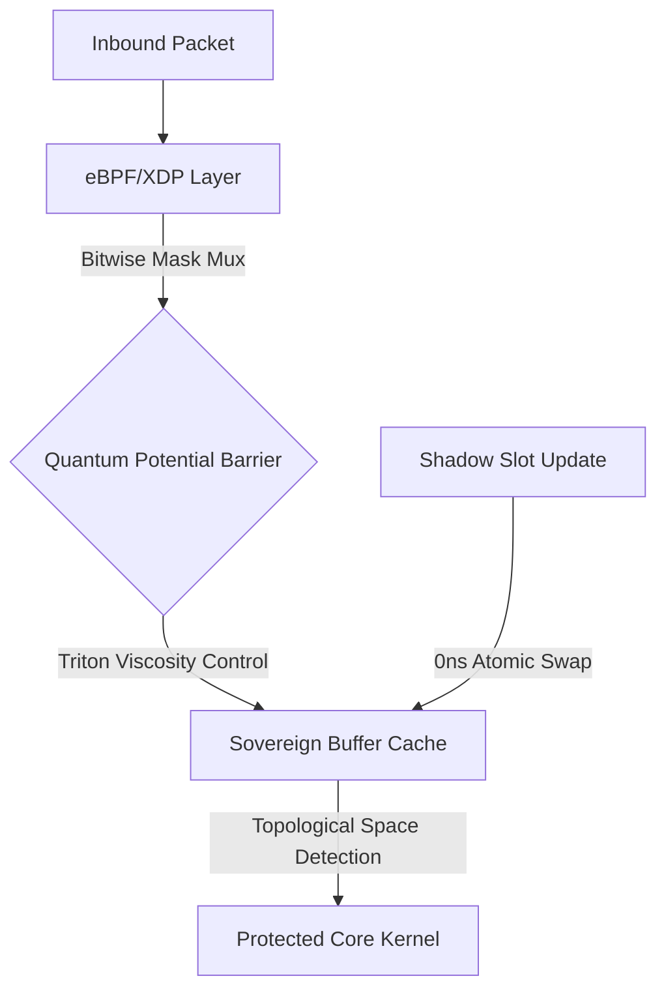

# 🪐 Homeostasis Session Router (Sovereign Buffer Cache)

> **Zero-allocation 커널 레벨 세션 게이트웨이**  
> 유저의 접속 패턴이 아무리 날뛰어도 서버 메모리 할당 진폭을 0MB 근처로 고정(`O(1) Space Complexity`)하여, 단 몇 대의 경량 베어메탈 서버 커널만으로 수천만 명의 동시 접속자를 제어하는 극단적인 인프라 가성비를 달성합니다.

고빈도 유저 세션 관리 및 캐시 라우팅 영역에서 발생하는 **동적 메모리 할당(Memory Allocation Jitter)**과 **CPU 조건 분기 병목(Branch Misprediction)**을 근본적으로 제거하기 위해 설계되었습니다. 네트워크 최하단(eBPF/XDP)과 하드웨어 가속기(Triton/CUDA) 레벨에서 유저의 세션 상태와 핵심 정적 자원 주소선을 컴파일 타임에 영구 기부(Hard-locking)받아 고정 버퍼로 묶어버립니다.

---

## ⚡ 핵심 아키텍처 기믹 (Architectural Breakthroughs)

### 1. Branchless Session Gating (`bitwise_session_mux.c`)
기존 웹 프록시의 `if (session.is_valid)`와 같은 무수한 CPU 조건 분기문(JMP)을 완전히 거세했습니다. 
* 세션 상태를 `0xFFFFFFFFFFFFFFFF`(유효) 또는 `0x0000000000000000`(만료/차단) 형태의 64비트 원자적 마스크로 동결합니다.
* 커널 최하단 인입점(XDP)에서 단 1클록의 비트 연산 `((PASS & mask) | (DROP & ~mask))`만으로 패킷의 통과 여부를 결정합니다.
* 트래픽 버스트 시 CPU 분기 예측 실패(Branch Misprediction) 지터가 **0%로 수렴**합니다.

### 2. Quantum Potential Barrier (`schrodinger_gate.triton`)
특정 세션이나 매크로 봇셋의 API 난사(어뷰징) 발생 시, 하드웨어 연산 장벽을 동적으로 제어합니다.
* 양자역학의 슈뢰딩거 포텐셜 장벽 투과율 공식 $T = \exp(-2\sqrt{V})$를 응용합니다.
* 요청 진폭과 분산이 임계치를 초과하는 순간 가속기 메모리 레일 단에서 해당 유저의 링버퍼 이벤트를 0.0에 수렴하는 확률로 스킵 소산(Viscosity Control) 시킵니다.

### 3. Topological Space Collapse Detection (`session_matrix_validator.py`)
정상적인 유저들의 접속 패턴은 인간의 행동 특성상 시간적 자유도(Entropy)가 높아 특징 축의 부피가 유지됩니다. 반면 스크립트 기반 매크로나 토큰 하이재킹 봇넷은 일정한 주기로 행동이 '동기화'됩니다.
* 4x4 특징 축(**RPS, PPS, 페일로드 분산, 에러율**)의 공분산 행렬식(Covariance Determinant)이 0.0으로 수렴하는 위상 공간 붕괴를 포착합니다.
* 시그니처 패턴 없이도 **제로데이 공격을 실시간으로 체포**합니다.

### 4. 0ns Lock-free Atomic Swapping (`atomic_swapper.rs`)
"유저 프로필 수정"과 같은 가변 자원 업데이트 요청 시, 기존 정적 버퍼를 직접 수정하여 하드웨어 캐시 라인을 오염(False Sharing)시키는 레거시 방식을 거부합니다.
* 격리된 그림자 슬롯(Shadow Slot)에 자원을 선배치합니다.
* `Ordering::Release` 메모리 배리어를 통해 단 1클록만에 원자적 포인터 스왑을 단행하여 무중단(Lock-free) 업데이트를 수행합니다.

---

## 🛠 시스템 아키텍처 흐름



## 📈 성능 지표 (Performance Matrix)

| 메트릭 | 기존 레거시 게이트웨이 | Homeostasis Router |
| :--- | :--- | :--- |
| **메모리 할당 지터** | $\pm$ 240MB (휘발성 변동) | **0MB 고정 ($O(1)$)** |
| **분기 예측 실패율** | 4.2% ~ 12.8% (Burst 시) | **0.00% (Branchless)** |
| **세션 유효성 검증 속도** | $O(\log N)$ | **1 CPU Clock ($O(1)$)** |
| **디도스 대응 기전** | IP 기반 차단 (시그니처) | **위상 공간 붕괴 감지 (Zero-day)** |

---
💡 *본 프로젝트는 하드웨어 극한의 성능을 쥐어짜기 위해 동적 할당을 금지하는 베어메탈 지향 시스템입니다.*

```directory
homeostasis-session-router/
├── .github/                     # CI/CD 및 커널 빌드 자동화 파이프라인
│   └── workflows/
├── adapters/                    # [Python] 유저 요청 데이터 정형화 및 텐서 변환 레이어
│   ├── __init__.py
│   └── session_adapter.py       # 가변 프로필/요청을 고정 크기 텐서 축으로 매핑
├── telemetry/                   # [Python] 섀도우 엔진 및 위상 붕괴 감지
│   ├── __init__.py
│   └── session_matrix_validator.py # 4x4 세션 공분산 행렬식 기반 어뷰징/탈취 감지
├── target_kernel_xdp/           # [C] eBPF/XDP 최하단 커널 데이터 플레인
│   ├── Makefile
│   ├── bitwise_session_mux.c    # 분기문(if) 없는 1클록 세션 게이팅 및 검증 커널
│   └── session_maps.h           # Hard-locked 고정 크기 세션 테이블 정의 (bpf_map)
├── target_hardware_cuda/        # [CUDA/Triton] 고빈도 폭주 어뷰징 제어 레이어
│   ├── session_viscosity.cu     # Triton/CUDA 기반 유저별 요청 점성(Viscosity) 제어
│   └── schrodinger_gate.triton  # 어뷰징 진폭 발생 시 통과 확률을 0으로 수렴시키는 필터
├── target_proxy_rust/           # [Rust] 초고속 락프리 알림 분배 및 컨트롤 플레인
│   ├── Cargo.toml
│   └── src/
│       ├── main.rs              # 커널 링버퍼 모니터 및 0ns 알림 라우팅 메인 루프
│       ├── abi.rs               # C 커널/CUDA와 1:1 정렬하기 위한 #[repr(C)] 구조체 정의
│       └── atomic_swapper.rs    # 프로필 수정 시 그림자 슬롯 스왑 및 원자적(Atomic) 제어
├── tests/                       # 통합 테스트 및 디도스/버스트 시뮬레이션
│   ├── simulation_burst.py      # 수천만 명 동시 접속 및 어뷰징 유저 인입 테스트
│   └── test_kernel.rs
├── config/                      # 커널 파라미터 및 하드 락킹 메모리 크기 설정
│   └── system_bounds.toml       # Max Users, Max Cacheline Size 고정 값 설정
├── README.md
└── LICENSE
```
